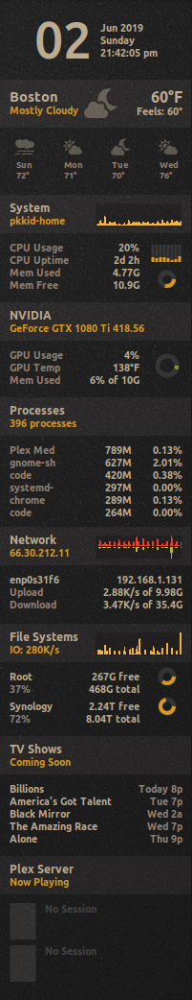

# PKMeter-Conky

This is a script that auto-generates the Conky configuration you see to the
right. Each widget in the the Conky configuration can be configured or disabled
completly if you decide not to use it.

### Installation
Clone this respositry and make sure you have the python-requirements installed
on your system.
```bash
git clone https://github.com/pkkid/pkmeter-conky.git
sudo apt install conky-all python3-json5 python3-dbus
```

The following command will generate a new ~/.conkyrc file and start Conky for
the first time.
```
pkmeter-conky/pkmeter.py conkyrc
conky -c pkmeter-conky/conkyrc
```
That's it, you should see Conky load up and start showing you stats! Anytime you
modify a configuration value, you will need to rerun pkmeter.py conkyrc.

Next, you will want to edit a few confiuguration options configure the output to your liking.
Open up the file `pkmeter-conky/config.json5`. In here you will see the basic
options most people will want to edit.

1. `openmeteo` - This this is the weather widget. You will want to update these
   settings to grab the right weather for your area.
2. `networks` - To find out what your the network device names are on your system
   you can run the command `ifconfig`. Add the devices you want to monitor to
   the devices section.
3. `filesystems` - By default, this only watches the root filesystem. However,
   the io chart requires you input the proper device name to be monitored. You
   can list the filesystems on your device with the command `df -h`. Add which
   ever ones you want to monitor to the filesystems section.

My personal configuration file looks like the following:
```json5
{
  widgets: [
    'clock',
    'openmeteo',
    'system',
    'nvidia',
    'processes',
    'networks',
    'filesystems',
    'nowplaying',
  ],
  openmeteo: {
    city_name: 'Holliston',
    latitude: 42.20,
    longitude: -71.42,
    temperature_unit: 'fahrenheit',
    timezone: 'America/New_York',
    wind_speed_unit: 'mph',
  },
  nvidia: {
    temperature_unit: 'fahrenheit',
  },
  networks: {
    devices: ['enp4s0'],
  },
  filesystems: {
    graph_fs: '/dev/nvme0n1p5',
    filesystems: [
      {name:'Root', path:'/'},
    ],                 
  },
}
```


### Advanced Configuration

If you want to configure things further, you should take a look at all the options
available to you in the defaults.json5 file. In general, you should not edit the
defaults file, and put any modifications in the config file.

If you want to use the same configuration file for multiple computers, you can
add custom options for each machine in config.json5. You do this by creating a
new section with the hostname of your pc in brackets. For example, suppose I wanted
to customize the network device to be monitored on my workpc. I can have a
configuration like the following.
```json5
{
  ...
  networks: {
    devices: ['enp4s0'],
  },
  [workpc]: {
    networks: {
      devices: ['enp0s10'],
    },
  }
}
```

## Whats Under the Hood
Besides Conky being the engine that displays all the stats. pkmeter.py is the
core script to help conky retrieve and cache additional metrics not available
in Conky by itself. This script has three main commands.

1. `conkyrc` - This will read config.json5 and generate both a new ~/.conkyrc
   file as well as a new pkmeter-conky/pkm/config.lua file to render backgrounds
   and charts.
2. `update <widget>` - A few widgets require reaching out to the internet to
   grab information, or call out to bash to fetch additional system data. After
   gathering this data, it will cache the results in `pkmeter-conky/cache` so
   we don't end up grabbing this data every 2 seconds.
3. `get <widget>.item.to.grab` - This is used by the conkyrc file to quickly
   fetch one of the values from the cached data and display it to the screen.


### Thanks
Fisadev for creating the Conky draw.lua scripts.
