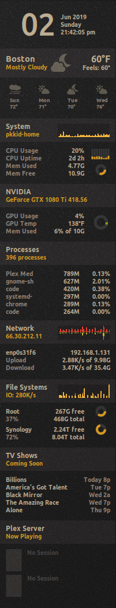

# Conky-PKMeter



A Conky configuration written entirely in Lua. It includes clock, weather,
system, GPU, process, network, filesystem, media, Bambu printer, and Codex usage
widgets.

## Installation

```bash
sudo apt install conky-all lua-socket lua-sec playerctl curl unzip
git clone https://github.com/pkkid/conky-pkmeter.git
cd conky-pkmeter
conky -c conkyrc
```

## Configuration

Widget settings and display order are defined in `config.lua`. Window placement,
size, and Conky behavior are configured in `conkyrc`.

- `openmeteo`: Set your location, timezone, units, and icon theme.
- `networks`: Find interface names with `ip link`, then configure the devices to monitor.
- `filesystems`: Find mount paths with `df -h`, then configure the paths to monitor.
- `nowplaying`: Uses `playerctl` for playback information and controls.
- `bambu`: Set the printer host, serial number, and LAN access code.

## Codex Usage

The Codex widget displays five-hour and weekly usage, compact reset times,
weekly pacing, and the top three locally recorded models by token share and
prompt count. It reads session records from `$CODEX_HOME` or `~/.codex`; it does
not run Codex, start an app server, access credentials, or make network requests.

Task status refreshes every five seconds, shown blue while running or orange
while waiting. Limits refresh every minute and models every five minutes.
Clicking forces a local rescan. Model percentages represent local token share,
not subscription-limit contribution. Codex's local session format may change.

## Auto Start

Add the following command to Ubuntu Startup Applications:

```bash
/usr/bin/bash -c "/usr/bin/sleep 5; cd ~/Projects/conky-pkmeter/ && conky -c conkyrc"
```

## Mouse Clicks

[Conky issue #2047](https://github.com/brndnmtthws/conky/issues/2047) can cause
mouse clicks to be reported as `mouse_enter` under XWayland and some X11 window
managers. As a temporary workaround, handle `mouse_enter` instead of
`button_down` in `pkmeter.lua` and use:

```lua
own_window_type = 'normal',
own_window_hints = 'skip_taskbar,sticky,below',
```

This workaround may display a window title on the panel.

## Credits

Fisadev and Zineddine SAIBI created the original Conky drawing scripts.
