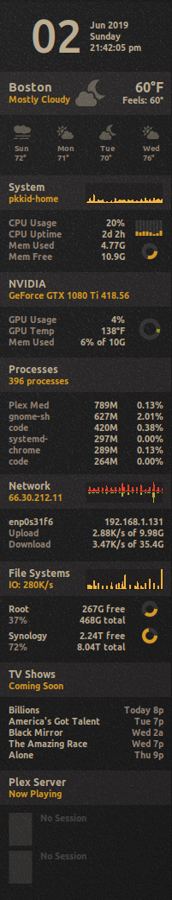

# Conky-PKMeter



A Conky configuration written entirely in Lua. It includes clock, weather,
system, GPU, process, network, filesystem, media, Bambu printer, Codex usage, and
Claude usage widgets.

## Installation

```bash
sudo apt install conky-all lua-socket lua-sec playerctl curl unzip
git clone https://github.com/pkkid/conky-pkmeter.git
cd conky-pkmeter
conky -c conkyrc
```

## Configuration

Widget settings and display order are defined in `config.lua`. Window placement,
size, and Conky behavior are configured in `conkyrc`.
Long titles, including accented characters and emoji, are shortened to fit.

- `openmeteo`: Set your location, timezone, units, and icon theme.
- `networks`: Find interface names with `ip link`, then configure the devices to monitor.
- `filesystems`: Find mount paths with `df -h`, then configure the paths to monitor.
- `nowplaying`: Uses `playerctl` for playback information and controls.
- `bambu`: Set the printer host, serial number, and LAN access code.

## Codex Usage

The Codex widget displays available five-hour and weekly usage, compact reset
times, weekly pacing, and the top three locally recorded models by token share
and prompt count. Every 15 minutes it starts the locally installed
Codex App Server and reads the authenticated account's current limit snapshot;
it stores the result in `/tmp/pkmeter-codex.json`. Codex must be on `PATH` and
logged in with a supported account. API-key-only and Bedrock authentication do
not provide this account usage data. The poller also requires the standard
`timeout` command from GNU coreutils.

The header shows the plan and time since the last limit update. Weekly resets
show the local weekday (e.g. `Sun`), or the reset time when it is today
(e.g. `10:34a` or `9:30p`).

Task status refreshes every five seconds, shown blue while running or orange
while waiting; it reads local Codex session records for that state only.
Clicking the header refreshes cloud limits immediately. The model mix and
weekly pacing are hidden by default; click the widget content to toggle them,
or set `show_details = true`. Failed cloud reads retain the last
successful snapshot and retry with capped exponential backoff. The local model
mix refreshes every five minutes in a background Lua process without a network
request, and its default scan limit is 30 seconds. Its percentages are each
model's token share allocated against the selected cloud-reported limit, so it
excludes Codex activity from other machines and services.

## Claude Usage

The Claude widget mirrors the Codex widget: five-hour and weekly usage, reset
times, weekly pacing, task status, and the top three local models. Every 15
minutes it reads the account usage endpoint with `curl`, using Claude Code's
stored login in `~/.claude/.credentials.json` (or `$CLAUDE_CONFIG_DIR`), and
stores the result in `/tmp/pkmeter-claude.json`. It never refreshes the login
itself; an expired token shows stale data until Claude Code is used again.

Task status combines the live status Claude Code records for each running
process in `~/.claude/sessions`, shown blue while any session is running or
orange while any session waits for a permission, question, or dialog. This is
an undocumented Claude Code file and may change between releases. The model mix
reads local transcripts in `~/.claude/projects`.

## Auto Start

Add the following command to Ubuntu Startup Applications:

```bash
/usr/bin/bash -c "/usr/bin/sleep 5; cd ~/Projects/conky-pkmeter/ && conky -c conkyrc"
```

## Mouse Clicks

[Conky issue #2047](https://github.com/brndnmtthws/conky/issues/2047) can cause
mouse clicks to be reported as `mouse_enter` under XWayland and some X11 window
managers. As a temporary workaround, handle `mouse_enter` instead of
`button_down` in `pkmeter.lua` and use:

```lua
own_window_type = 'normal',
own_window_hints = 'skip_taskbar,sticky,below',
```

This workaround may display a window title on the panel.

## Credits

Fisadev and Zineddine SAIBI created the original Conky drawing scripts.
