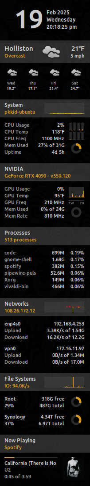

# PKMeter Conky Scripts

A collection of scripts and a Conky configuration for my setup. The scripts help
make fetching data easy and results are stored as json files in `~/.cache/pkmeter`.

### Available Scripts
* `pkmeter.py openweather` (Weather)
* `pkmeter.py externalip` (Extenral IP)
* `pkmeter.py nvidia` (GPU Temp)

### Requirements
* Packages: conky-all nethogs python3-requests python3-jinja2
* Fonts: Ubuntu (already present in Ubuntu)

### Installation
```bash
# Install required apt packages and clone the repo
# and symlink the scripts into place
sudo apt install conky-all nethogs python3-requests python3-jinja2
cd ~/Projects && git clone https://github.com/mjs7231/pkmeter-conky.git
ln -s ~/Projects/pkmeter-conky/pkmeter ~/.pkmeter

# Copy the example-config and edit with your desired configuration
cp ~/.pkmeter/config-example.json ~/.pkmeter/config.json
vim ~/.pkmeter/config.json

# Generate a new conkyrc and then start conky
python3 ~/.pkmeter/pkmeter.py conkyrc
conky

# To autostart on boot, add the following startup script
/usr/bin/bash -c "/usr/bin/sleep 5; /usr/bin/conky"
```

### Thanks
* Fisadev for creating the Conky Draw scripts.
